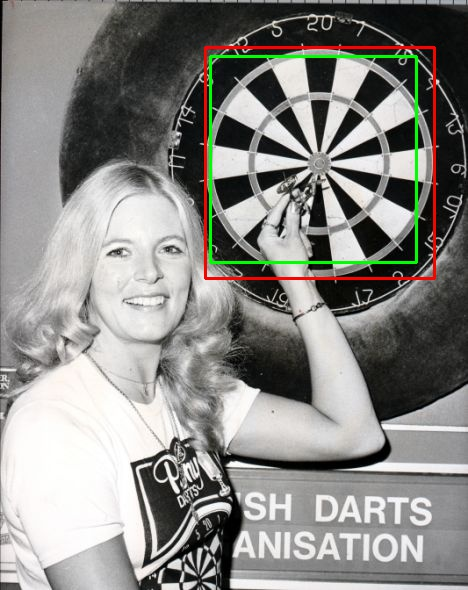
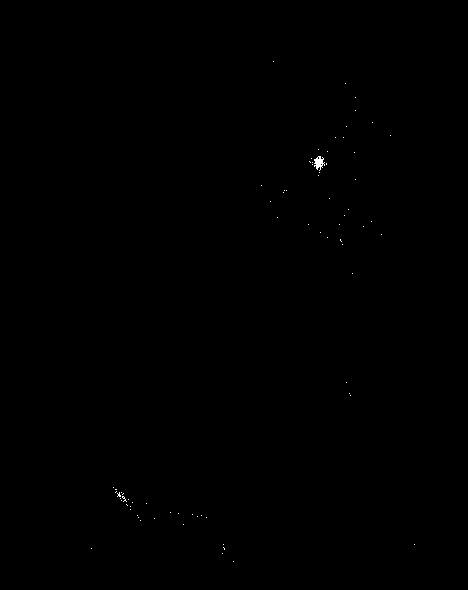
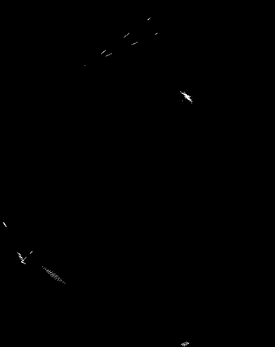

# Viola-Hough
A dartboard detection system that utilizes Viola-Jones to detect areas of possible dartboards in conjunction with Hough transforms to calculate both circle centres and line intersections in order to determine which detections are false positives so that they can be removed.

  